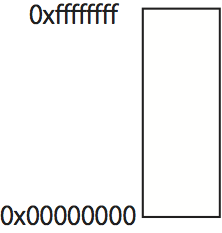

# ロボットシステム学第4回

上田 隆一

2017年10月11日@千葉工業大学


## 今日の内容

* プロセス等、Linuxの仕組みについて


## プロセス

* プログラム実行の一単位
  * 実行中のプログラム＋OSが準備した付帯情報* プロセスID、ユーザ、親プロセス
* 普段はps(1)やtop(1)で調査
  * CPUやメモリ使用量、ゴミプロセスがないか調査、等
* 一つのプロセスについて調査したければ `/proc/<プロセス番号>` を見る
  * プロセス情報もファイルで提供される。なんでもファイル


## カーネルから見たプロセス

* リソースを割り当てる一単位
  * メモリの割り当て
  * プログラムが自身のプロセス外のメモリを参照しないよう保護
  * 仮想アドレス空間
  * CPU の利用時間（タイムシェアリング）
  * 優先度の高低を考慮
    * 端末とのやり取りが多いものほど高頻度
      * ↑ロボットを動かす時に問題となる


## プロセスツリー

* プロセスはプロセスから生まれる
  * fork-execと呼ばれる仕組み
  * 家系図（プロセスツリー）ができる
    * pstree(1)で調査を
    * initというプロセスからぶら下がる
* プロセスツリーの役割
  * 親子間で環境や開いているファイルを引き継ぐ


## プロセスの観察

* psというコマンドを打ってみましょう
  * `$ ps aux`
* 項目の意味
  * USER: ユーザ, PID: プロセスID, %CPU: CPU 使用率,%MEM: メモリ使用率, VSZ: 仮想メモリのサイズ,RSS: 使用している物理メモリ量, TTY: 端末, STAT: プロセスの状態, START: 起動した時間, TIME: 使ったCPU 時間, COMMAND: コマンド名、カーネルスレッド名
* STATの意味
  * R: Run, S: Sleep, D: Disk Sleep, T: Stopped, Z: Zombie, +: forground, <: high priority, s: session leader


## top

* `$ top -c`
  * 項目の意味
    * PID: プロセスID, USER: ユーザ, PR: 優先度, NI: nice 値, VIRT: 仮想メモリ使用量, RES: 物理メモリ使用量, SHR: 共有メモリ使用量, S: プロセスの状態,%CPU: CPU 使用率, %MEM: 物理メモリ使用率, TIME+:CPU 使用時間, COMMAND: コマンド


## プロセス番号等

* `$ ps -eo command,pid,ppid,pgid,sid`
  * pid: プロセス番号: そのプロセス固有の番号
  * ppid: 親のプロセス番号
    * 今の親のプロセス番号
    * 親がいなくなると1（init）にぶら下がる
  * pgid: プロセスグループID: 同じジョブ（後述）の下にいるプロセスが共有するID
  * sid: セッションID: 一つの端末にぶら下がっているプロセスが共有するID

参考: https://linuxjm.osdn.jp/html/procps/man1/ps.1.html


## プロセスの一生

1. あるプロセスからforkして生まれる
    *  [forkを実行するコード](https://gist.github.com/ryuichiueda/9593919)
1. 新しいプロセスIDをもらう
1. 親の情報をすべて自分のメモリ空間にコピー（コピーしない場合もある）
1. （execされた場合）プログラムの部分が入れ替わる
    *  例: [execを行うシェルスクリプト](https://gist.github.com/ryuichiueda/063765e1e0d8b1e8a501)
1. プログラム実行
1. 終了。終了ステータスを返す
    * 0が正常終了、それ以外が何らかの異常
    *  終了ステータスの目視: `echo $?`


## forkと画面の入出力

* 何でコマンドの字が画面に出てくるのか？
  * 考えてみると不思議
  * シェルからコマンドがfork-execされる
  * fork-execされた時点で画面の入出力の口がコピーされて共有されている
  * 整理するとコマンドに入出力口がつながる


## forkとパイプ

* シェルが自分に入出力する口を作ってforkするという処理を繰り返していく
    * →コマンドが数珠つなぎに


## ジョブ

* シェルがプロセスを管理する塊
* 操作で把握しましょう

```bash
$ sleep 1000000 | cat | cat     #後ろのcatは特に意味はない
Ctrl+Z
 $ sleep 200000 | sleep 200000
Ctrl+Z
$ jobs

[1]-  停止                  sleep 1000000 | cat | cat 
[2]+  停止                  sleep 200000 | sleep 200000
$ fg 2      これでjob2がフォアグラウンドに

sleep 200000 | sleep 200000
Ctrl+Z
$ kill %1        #job1を殺す

$ jobs

[1]-  Terminated              sleep 1000000 | cat | cat
[2]+  停止                  sleep 200000 | sleep 200000
$ bg 2       #job2をバックグラウンド起動

[2]+ sleep 200000 | sleep 200000 &
$ jobs

[2]+  実行中               sleep 200000 | sleep 200000 &
$ fg 2    #job2をフォアグラウンドへ

sleep 200000 | sleep 200000
Ctrl+C
```

## シグナル

* プロセス間通信の一種
* あるプロセスから他のプロセスへの「合図」
  * ジョブのコントロールでやったCtrl+ZやCtrl+Cでも送られている
* シグナルの一覧
  * `$ kill -l`
* killコマンドで送ることができる
  * `$ kill -KILL 12345`     #SIGKILL（後述）をPID12345に
  * `$ kill 12345`           #SIGTERMをPID12345に

* 発展: trapコマンドを使うとシェルスクリプト内でシグナルを捕捉して割り込み処理が書ける

## 主なシグナル

* SIGHUP（1番）
  * HUP: ハングアップ（電話の切断）
  * 使われ方
    * 端末が切れるとセッションリーダにSIGHUPが飛ぶ
      * セッションリーダー: セッションIDの持ち主
    * セッションリーダーがいなくなるとカーネルからSIGHUPがセッションのプロセスに送られる
  * web サーバ（apache）の再起動


* SIGINT（2 番）
  * INT: interrupt（割り込み）
  * 使われ方
    * 端末でCtrl+c を押したときに端末からセッショングループのフォアグラウンドプロセスに送られる
* SIGKILL（9 番）
  * プロセスを強制終了するときに使われる
  * プログラム側で後始末できない
  * 後始末はカーネルに任せる
* SIGSEGV（11 番）: メモリのセグメンテーションフォルト
* SIGPIPE（13 番）: 読み書きしていたパイプの切断
* SIGTERM（15番）: 終わってくれてというシグナル。プログラムは速やかに終わらないといけない


## プロセスとメモリ

* プロセスは、基本的に他のプロセスが使っているメモリの中身を見ることができない
  * **見ることができたら事故**
* プロセス間でメモリが見えないようにする仕組み: 仮想記憶
  * 問題: 図のような1列のメモリをどのように複数のプロセスに割り当てる？




仮想記憶
（ページング方式）

アドレス空間を二種類用意
物理アドレス空間（DRAMやその他を直接指す）
仮想アドレス空間（プロセスごとに準備）
アドレス空間を「ページ」に分割
仮想のページと物理ページを対応付け


仮想記憶の導入で可能となること

別のプロセスのメモリ番地が見えない
 lazyな物理メモリ割り当て
プログラムが割り当てのないページの番地にアクセスした時に、物理メモリのページを割り当て
割り当てのないページの番地にアクセスすることを「ページフォルト」と言い、これが起こると割り当てが起こる
スワップ
メモリが不足時にページ上のデータをストレージ上のページに追い出せる（スワップアウト）
仮想アドレスの先が物理メモリである必要がなくなる


キャッシュの管理が簡単に
プロセスが使用していない物理メモリのページに
読み書きしたファイルのデータを記憶
キャッシュが有効だとHDDの読み書き回数を減らすことができる


来週

電子回路とプログラミングとなっていましたが・・
ファイルシステムとデバイスの話をします
